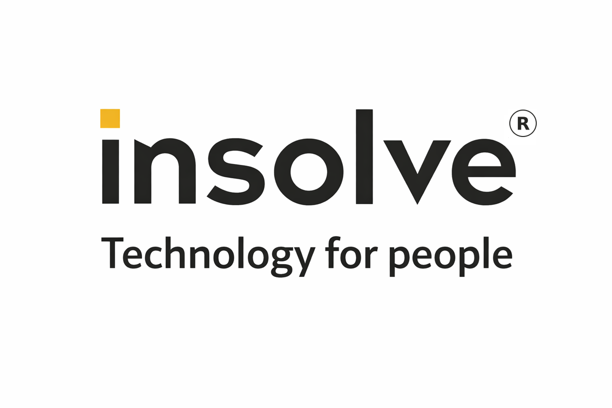

# 🏆 BetterDesk Sponsors & Honorary Supporters

BetterDesk would not be where it is today without the support of organizations
and individuals who believe in open, secure, and self-hostable remote-management
software. This page acknowledges them with our deepest gratitude.

---

## 🥇 Honorary Supporters

### INSOLVE

**INSOLVE** is recognized as an **Honorary Supporter** of the BetterDesk project.
Their support has directly contributed to security audits, hardening work, and
the continued development of the BetterDesk Go server, web console, and
operator/agent clients.

- **Website:** [insolve.pl](https://insolve.pl)
- **Role:** Honorary Supporter
- **Contribution areas:** Security review, production audits, infrastructure
  testing, real-world deployment feedback.

Thank you, INSOLVE, for backing free and open remote-desktop software. 🙏

---

## 💖 How to Sponsor

BetterDesk has been growing rapidly — from a passion project driven by vibe
coding into a tool that individuals and commercial companies rely on every day.
To ensure that BetterDesk remains stable, secure, and continuously updated with
new features, we have officially opened sponsorship and donation options.

Choose whichever platform suits you best:

- **Monthly or Tiered Sponsorship:** [Become a GitHub Sponsor](https://github.com/sponsors/UNITRONIX)
- **One-time Donations:** [Buy Me a Coffee](https://buymeacoffee.com/unitronix)

### 💡 Where does the money go?

Your support directly fuels the development of the project. The funds are
used for:

- **AI Development Tools** — Covering the subscription costs of tools like
  GitHub Copilot, which allows us to prototype and ship new features at
  lightning speed.
- **Infrastructure & Testing** — Maintaining the necessary environments to keep
  the code clean and stable.
- **Fueling the Creator** — Simply buying the maintainer a coffee (or a meal!)
  to compensate for the private free time invested into coding this project late
  at night and during weekends.

---

## 🎁 Supporter Perks & Tiers

### ☕ Individual Backers

*One-time or small monthly donations*

- **A Huge Thank You** — Every coffee matters and keeps the vibe coding going!
- **Supporter Badge** — Show off your support directly on your GitHub profile.
- **Your Name in the Repo** — Backers will be mentioned in this file's special
  thanks section (with permission).

### 🏢 Corporate Sponsors

*Monthly tiers for companies*

If your business relies on BetterDesk, supporting the project ensures its
long-term viability:

- **Priority Triage** — Your bug reports and feature requests will jump to the
  front of the queue and be reviewed first.
- **Roadmap Advisory** — Have a voice in the project's future direction. If your
  required feature aligns with the project's vision, it gets top priority.
- **Brand Visibility** — Your company logo and a link to your website will be
  proudly displayed in the main `README.md` and project documentation.
- **Guaranteed Open Source** — Any feature developed thanks to your sponsorship
  will be merged directly into the main repository under the Apache 2.0 license
  for everyone to use.

### 🥇 Honorary Supporters

*Reserved for organizations that have made a significant non-monetary
contribution (audits, infrastructure, sustained mentorship).*

- Logo + dedicated section in `SPONSORS.md` and README badge.

> [!NOTE]
> **Governance:** To maintain maximum security and architectural consistency,
> all development remains strictly in the maintainer's hands (no external PRs
> accepted for now). Sponsorship does not grant ownership or veto power over the
> project's roadmap, ensuring BetterDesk remains independent and secure.

---

## 📋 Other ways to contribute

- **Code contributions:** see [CONTRIBUTING.md](docs/development/CONTRIBUTING.md)
- **Security disclosures:** see [docs/security/](docs/security/)
- **Corporate partnership / honorary supporter status:** open an issue or
  contact the maintainers via the repository.

---

*Last updated: 2026-05-28*
