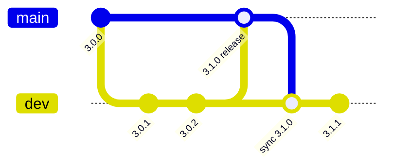

# Branching and versioning

BetterDesk uses two Git branches and automated product versioning across the repository.

## Branches

| Branch | Role | Version bump | GitHub Release |
|--------|------|--------------|----------------|
| **`dev`** | Active development; default target for pull requests | **+0.0.1** on every push (CI commit `[version-bump]`) | No — Docker images tagged `dev` / `sha-*` on GHCR |
| **`main`** | Stable production; stricter review and [PRE_RELEASE_CHECKLIST.md](../PRE_RELEASE_CHECKLIST.md) | **+0.1.0** when a PR is merged into `main` | Yes — tag `vX.Y.Z`, GitHub Release, server binaries, semver Docker tags |

### Typical flow

1. Feature branches merge into **`dev`** (patch version auto-increments).
2. When ready for production, open a PR **`dev` → `main`** and complete the release checklist.
3. On merge, CI bumps minor version, tags, and publishes a release.
4. Merge **`main` → `dev`** so development continues from the new minor baseline (e.g. `3.1.0` → next dev commits `3.1.1`, `3.1.2`, …).



## Product version files (Tier 1 + 2)

Canonical version: root [`VERSION`](../../VERSION) file.

Every automated bump updates these together:

**Tier 1**

- `VERSION`
- `web-nodejs/package.json` (npm mirror; panel reads root `VERSION` via `web-nodejs/lib/productVersion.js`)
- `betterdesk-server/VERSION` and `betterdesk-server/internal/productversion/VERSION` (Go `go:embed` + builds)
- `betterdesk.sh`, `betterdesk.ps1`, `betterdesk-docker.sh`
- `CHANGELOG.md` (moves `[Unreleased]` → new section)
- `README.md` (version badge)

**Tier 2 (Docker)**

- `Dockerfile`, `Dockerfile.server`, `Dockerfile.console`
- `docker-compose.quick.yml`, `docker-compose.quick.macvlan.yml`
- `docker/entrypoint.sh`, `docker-entrypoint.sh`

The web console and Go server should report the **same product semver** after a normal install, panel update, or release build. Settings → Server Information shows both the product version and the live Go server version from `/api/health`.

Sub-project versions (`betterdesk-mgmt`, `betterdesk-agent-client`, SDKs) are **not** bumped with the main product unless explicitly requested.

### Maintainer commands

```bash
# Verify all Tier 1/2 files match VERSION (CI runs this too)
node scripts/bump-version.js --verify

# List every path touched by automated bumps (used by CI git add)
node scripts/bump-version.js --list-paths

# Manual bump (normally CI handles this)
node scripts/bump-version.js --patch    # +0.0.1
node scripts/bump-version.js --minor    # +0.1.0
node scripts/bump-version.js --set 3.2.0
node scripts/bump-version.js --patch --dry-run
```

## GitHub repository settings (operator)

Configure once in GitHub (not in git):

1. **Default branch → `dev`** — new clones and PRs target active development.
2. **Protect `main`** — require PR, require status checks (`Web Console CI`, `Secret Scan`, `Version Verify`), disallow direct push.
3. **Optional: protect `dev`** — require CI on PRs without release checklist.

## Update channel (stable / development)

Installations pull updates from a GitHub branch:

| Channel | Branch | Use case |
|---------|--------|----------|
| **Stable** | `main` | Production (default) |
| **Development** | `dev` | Early testing |

### Panel (Settings → Updates)

Select **Stable (main)** or **Development (dev)** and click **Apply channel**. The setting is stored in `web-nodejs/.env` as `UPDATE_GITHUB_BRANCH`. Systemd loads it via `EnvironmentFile`; Windows NSSM loads `.env` at console startup.

After switching channel, run **Check for updates** — the tracked commit SHA is kept, so the first check against a new branch may show a large diff.

### Installer scripts

- **Linux:** `betterdesk.sh` → Update → **Switch update channel**
- **Windows:** `betterdesk.ps1` → Update → **Switch update channel**
- **Docker:** `betterdesk-docker.sh` → Update → **Switch update channel**

Environment variable (all paths):

```bash
UPDATE_GITHUB_BRANCH=main   # stable
UPDATE_GITHUB_BRANCH=dev    # development
```

## CI workflows

| Workflow | Trigger | Action |
|----------|---------|--------|
| `version-bump-dev.yml` | Push to `dev` | Patch bump + commit `[version-bump]` |
| `version-bump-main.yml` | PR merged to `main` | Minor bump, tag, GitHub Release |
| `version-verify.yml` | Push/PR touching version files | Fail if files disagree |
| `release-server.yml` | Tag `v*` | Go server binaries |
| `docker-publish.yml` | Tag, release, push to `main`/`dev` | GHCR images: `latest` on stable release/main; `dev` on `dev` pushes; semver on `v*` / Release |

## First stable release note

If `VERSION` is `3.0.0` but no `v3.0.0` tag exists yet, create it once manually after enabling this workflow, or merge the first PR to `main` to let CI publish `v3.1.0`.
